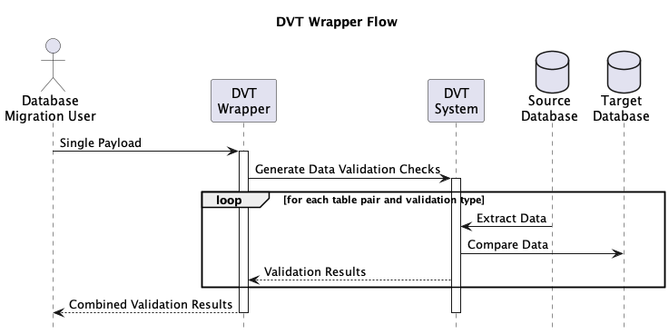

# Data Validation Tool (DVT) Wrapper API

The purpose of the DVT Wrapper is to enable database migration users to submit a single payload, which in turn generates data validation checks by interacting with the DVT system. For each table pair to compare and each data validation type to execute, a separate request is generated.

The API allows you to submit a payload containing information about the source and target databases, as well as the tables and columns to be validated. A consolidated data validation result report is then returned.

The Pydantic models are responsible for verifying the payload. If both the request payload and the Pydantic models pass validation, the process will proceed, and the DVT system will be called N number of times based on the user input. If there is a discrepancy in the validation, an exception will be returned to the user.

## Endpoints

### /dvt-run-validation

* Method: POST
* Description: This endpoint is responsible for validating the user input, generating DVT payload and initiating requests to the DVT API.
It accepts a JSON payload in the request body containing the source and target database configurations, tables, validation type, and optional columns.

## Models

* DB: A Pydantic model representing a generic database configuration. It includes fields like db_type, db_host, db_name, db_user, db_port, and db_password.
* TargetDataBase: A model that inherits from DB and represents the target database configuration.
* SourceDataBase: A model that inherits from DB and represents the source database configuration.
* SourceTargetPayload: A Pydantic model representing the payload to be sent to the DVT API.

## Example Payload and Example Response

The provided payload initiates four data validation jobs, each of the row_count, sum_column, Schema, row_hash type. One validation request will be executed for each table pair to compare.
And the response contains the validation results for all validation types and table pairs. Find all the collection of payloads under the assets directory.

* Request - 1
```json
{
    "source_database": {
        "db_type": "MSSQL",
        "db_host": "source-db-host",
        "db_name": "source-db-name",
        "db_port": "5432",
        "db_user": "source-db-user",
        "db_password": "source-db-password"
    },
    "target_database": {
        "db_type": "Postgres",
        "db_host": "target-db-host",
        "db_name": "target-db-name",
        "db_user": "target-db-user",
        "db_port": 15432,
        "db_password": "target-db-password"
    },
    "tables": "dbo.departments,public.departments; dbo.foo,public.foo",
    "validation_type": "rowcount",
    "pct_threshold": 2,
    "project_id": "m2m-wayfair-dev",
    "striim_node": "http://35.188.117.143:9082/"
}
```

* Response - 1
```json
{
  "response": true,
  "results": [
    {
      "validation_name": "count",
      "validation_type": "Column",
      "aggregation_type": "count",
      "source_table_name": "dbo.foo",
      "source_agg_value": "4463527",
      "target_table_name": "public.foo",
      "target_agg_value": "853834",
      "difference": -3609693.0,
      "pct_difference": -80.87086736565053,
      "pct_threshold": 0.0,
      "validation_status": "fail"
    },
    {
      "validation_name": "count",
      "validation_type": "Column",
      "aggregation_type": "count",
      "source_table_name": "dbo.mytable",
      "source_agg_value": "1",
      "target_table_name": "public.mytable",
      "target_agg_value": "1",
      "difference": 0.0,
      "pct_difference": 0.0,
      "pct_threshold": 0.0,
      "validation_status": "success"
    }
  ]
}
```

* Request - 2
```json
{
    "source_database": {
        "db_type": "MSSQL",
        "db_host": "source-db-host",
        "db_name": "source-db-name",
        "db_port": "5432",
        "db_user": "source-db-user",
        "db_password": "source-db-password"
    },
    "target_database": {
        "db_type": "Postgres",
        "db_host": "target-db-host",
        "db_name": "target-db-name",
        "db_user": "target-db-user",
        "db_port": 15432,
        "db_password": "target-db-password"
    },
    "tables": "dbo.foo,public.foo",
    "validation_type": "sum_column",
    "pct_threshold": 2,
    "project_id": "m2m-wayfair-dev",
    "columns": "id,id",
    "striim_node": "http://35.188.117.143:9082/"
}
```

* Response - 2
```json
{
  "response": true,
  "results": [
    {
      "validation_name": "count",
      "validation_type": "sum_column",
      "aggregation_type": "count",
      "source_table_name": "dbo.foo",
      "source_agg_value": "4463527",
      "target_table_name": "public.foo",
      "target_agg_value": "853834",
      "difference": -3609693.0,
      "pct_difference": -80.87086736565053,
      "pct_threshold": 0.0,
      "validation_status": "fail"
    },
    {
      "validation_name": "count",
      "validation_type": "Column",
      "aggregation_type": "count",
      "source_table_name": "dbo.mytable",
      "source_agg_value": "1",
      "target_table_name": "public.mytable",
      "target_agg_value": "1",
      "difference": 0.0,
      "pct_difference": 0.0,
      "pct_threshold": 0.0,
      "validation_status": "success"
    }
  ]
}
```

* Request - 3
```json
{
    "source_database": {
        "db_type": "MSSQL",
        "db_host": "source-db-host",
        "db_name": "source-db-name",
        "db_port": "5432",
        "db_user": "source-db-user",
        "db_password": "source-db-password"
    },
    "target_database": {
        "db_type": "Postgres",
        "db_host": "target-db-host",
        "db_name": "target-db-name",
        "db_user": "target-db-user",
        "db_port": 15432,
        "db_password": "target-db-password"
    },
    "type": "Schema",
    "validation_type": "Schema",
    "tables": "dbo.departments,public.departments",
    "grouped_columns": [],
    "aggregates": [
        {
            "source_column": null,
            "target_column": null,
            "field_alias": "count",
            "type": "count"
        }
    ],
    "pct_threshold": 2,
    "result_handler": null,
    "labels": [
        [
            "label_1_name",
            "label_1_value"
        ],
        [
            "label_2_name",
            "label_2_value"
        ]
    ],
    "format": "table",
    "project_id": "m2m-wayfair-dev",
    "striim_node": "http://35.188.117.143:9082/"
}
```

Response - 3
```json
{
    "response": true,
    "results": [
        {
            "validation_name": "departments.Schema",
            "validation_type": "Schema",
            "aggregation_type": "Schema",
            "source_table_name": "dbo.departments",
            "source_agg_value": "int32[non-nullable]",
            "target_table_name": "public.departments",
            "target_agg_value": "int32[non-nullable]",
            "difference": null,
            "pct_difference": null,
            "pct_threshold": null,
            "validation_status": "success",
            "labels": [
                [
                    "label_1_name",
                    "label_1_value"
                ],
                [
                    "label_2_name",
                    "label_2_value"
                ]
            ],
            "format": null,
            "group_by_columns": null,
            "primary_keys": null,
            "num_random_rows": null
        },
        {
            "validation_name": "departments.Schema",
            "validation_type": "Schema",
            "aggregation_type": "Schema",
            "source_table_name": "dbo.departments",
            "source_agg_value": "string[non-nullable]",
            "target_table_name": "public.departments",
            "target_agg_value": "string[non-nullable]",
            "difference": null,
            "pct_difference": null,
            "pct_threshold": null,
            "validation_status": "success",
            "labels": [
                [
                    "label_1_name",
                    "label_1_value"
                ],
                [
                    "label_2_name",
                    "label_2_value"
                ]
            ],
            "format": null,
            "group_by_columns": null,
            "primary_keys": null,
            "num_random_rows": null
        },
        {
            "validation_name": "departments.Schema",
            "validation_type": "Schema",
            "aggregation_type": "Schema",
            "source_table_name": "dbo.departments",
            "source_agg_value": "int32",
            "target_table_name": "public.departments",
            "target_agg_value": "int32",
            "difference": null,
            "pct_difference": null,
            "pct_threshold": null,
            "validation_status": "success",
            "labels": [
                [
                    "label_1_name",
                    "label_1_value"
                ],
                [
                    "label_2_name",
                    "label_2_value"
                ]
            ],
            "format": null,
            "group_by_columns": null,
            "primary_keys": null,
            "num_random_rows": null
        }
    ]
}
```

Request - 4
```json
{
    "source_database": {
        "db_type": "MSSQL",
        "db_host": "source-db-host",
        "db_name": "source-db-name",
        "db_port": "5432",
        "db_user": "source-db-user",
        "db_password": "source-db-password"
    },
    "target_database": {
        "db_type": "Postgres",
        "db_host": "target-db-host",
        "db_name": "target-db-name",
        "db_user": "target-db-user",
        "db_port": 15432,
        "db_password": "target-db-password"
    },
    "tables": "dbo.departments,public.departments",
    "validation_type": "row_hash",
    "type": "Row",
    "pct_threshold": 2,
    "project_id": "m2m-wayfair-dev",
    "striim_node": "http://35.188.117.143:9082/",
    "primary_keys": [
        {
            "field_alias": "department_id",
            "source_column": "department_id",
            "target_column": "department_id",
            "cast": null
        }
    ],
    "comparison_fields": [
        {
            "field_alias": "department_name",
            "source_column": "department_name",
            "target_column": "department_name",
            "cast": null
        }
    ],
    "filter_status": null,
    "use_random_rows": true,
    "random_row_batch_size": 10
}
```

Response - 4
```json
{
    "response": true,
    "results": [
        {
            "validation_name": "departments.row_hash",
            "validation_type": "Row",
            "aggregation_type": null,
            "source_table_name": "dbo.departments",
            "source_agg_value": "Administration",
            "target_table_name": "public.departments",
            "target_agg_value": "Administration",
            "difference": null,
            "pct_difference": null,
            "pct_threshold": 0,
            "validation_status": "success",
            "labels": [],
            "format": null,
            "group_by_columns": "{\"department_id\": \"1\"}",
            "primary_keys": "{department_id}",
            "num_random_rows": null
        },
        {
            "validation_name": "departments.row_hash",
            "validation_type": "Row",
            "aggregation_type": null,
            "source_table_name": "dbo.departments",
            "source_agg_value": "Marketing",
            "target_table_name": "public.departments",
            "target_agg_value": "Marketing",
            "difference": null,
            "pct_difference": null,
            "pct_threshold": 0,
            "validation_status": "success",
            "labels": [],
            "format": null,
            "group_by_columns": "{\"department_id\": \"2\"}",
            "primary_keys": "{department_id}",
            "num_random_rows": null
        }
    ]
}
```

## Application Flow


